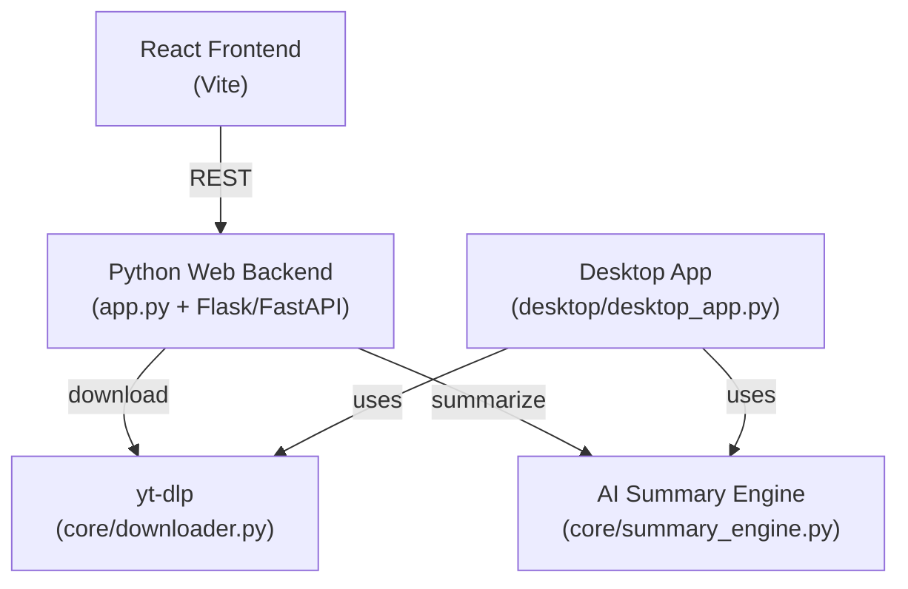
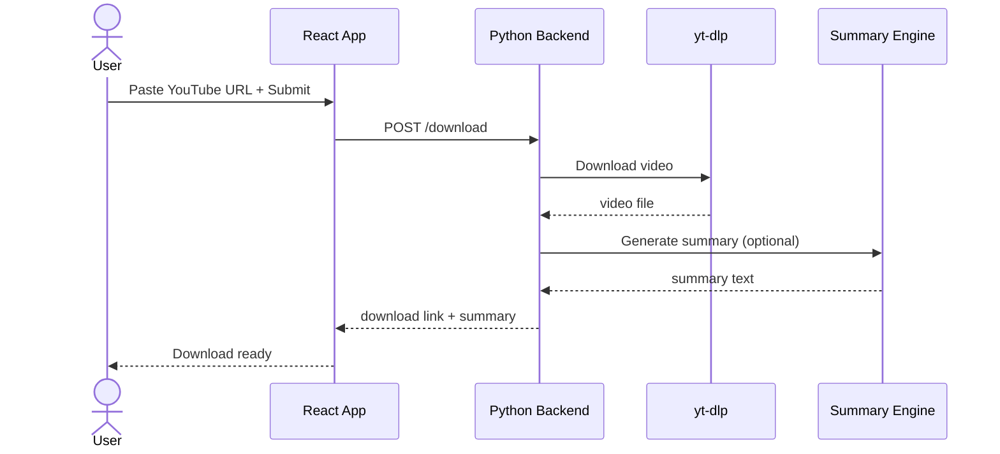
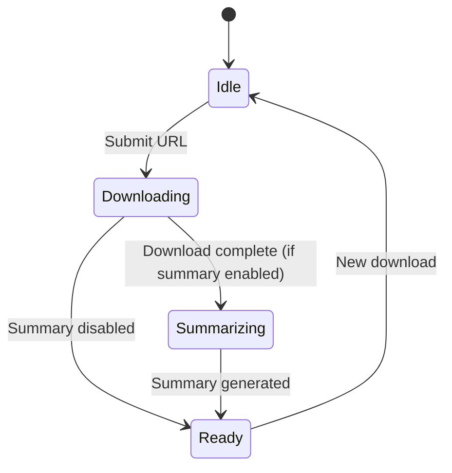

# youtube_downloader — Overview

## What This Is
A YouTube video downloader with both a desktop GUI (Tkinter/PyInstaller) and a web interface (React + Python backend). Downloads videos and optionally generates AI summaries using a local LLM.

## Who It's For
Personal use — downloading YouTube content for offline viewing with optional summarization.

## Problem It Solves
Provides a simple, self-hosted alternative to online YouTube downloaders with an added AI summarization capability.

## How It's Used
Users paste a YouTube URL. The downloader fetches the video via yt-dlp; optionally, the AI summary engine generates a transcript summary. Available as a local desktop app or a web-based Docker-deployed service.

## Component Stack

## Data Flow

## Behavioral Model

---
*Generated by github-repo-overview skill · Last updated: 2026-06-09 · Stack: Python + yt-dlp + React + Docker + PyInstaller*
