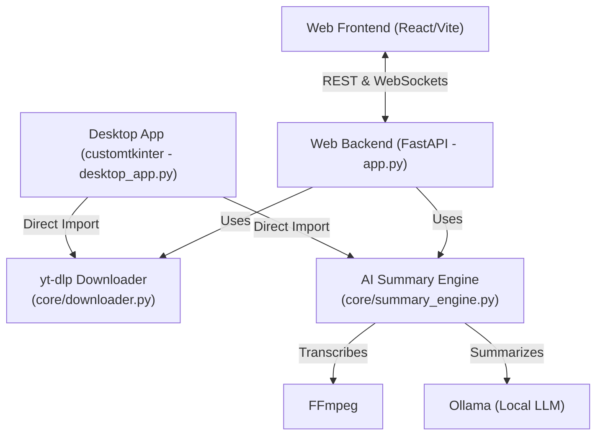

# YouTube Downloader Architecture & UI Elements (agents.md)

This document provides a comprehensive technical overview of the YouTube Downloader project architecture, detailing the interaction between the core logic, backend APIs, and frontend interfaces (both Web and Desktop). It also serves as an exhaustive catalog of all UI elements and their functional behaviors.

## System Architecture Overview

The system is designed with a shared core logic layer used by two distinct presentation layers: a Python Desktop GUI and a React-based Web Application.

### Components

1.  **Core Logic (`core/`)**:
    *   **Downloader (`downloader.py`)**: Utilizes `yt-dlp` to fetch media. Supports video, audio-only, browser cookie authentication, and time-slicing.
    *   **Summary Engine (`summary_engine.py`)**: Uses FFmpeg to extract audio, transcribes audio to text (using Whisper or similar local models), and summarizes transcripts via a local Ollama instance.
2.  **Web Backend (`web/backend/app.py`)**:
    *   Built with **FastAPI**.
    *   Provides REST endpoints for file uploads (`/api/upload`), video listing (`/api/videos`), and deletion (`/api/videos/{filename}`).
    *   Uses **WebSockets** (`/ws/download`, `/ws/transcribe`) to provide real-time log streaming and progress updates to the frontend without HTTP timeout issues.
    *   Contains a background worker to clean up downloaded files older than 24 hours.
3.  **Web Frontend (`web/frontend/src/App.jsx`)**:
    *   Built with **React**.
    *   Connects to the FastAPI backend via WebSockets to initiate downloads/transcriptions and render real-time progress.
    *   Manages a "Library" of downloaded files via REST polling.
4.  **Desktop App (`desktop/desktop_app.py`)**:
    *   Built with **customtkinter**.
    *   Runs downloader and transcription tasks in daemon threads, using `after(0, ...)` to safely update the GUI thread with progress and logs.

---

## Detailed UI Elements & Functional Behaviors

### 1. Web Application Interface (`App.jsx`)

The React frontend operates via a Tab-based interface managing distinct functional flows.

#### Global Header & Navigation
*   **App Header**: Displays "YouTube Media Hub".
*   **Library Button (`📁 Saved Library`)**: 
    *   *Action*: Opens the Saved Library modal overlay.
*   **Main Navigation Tabs**:
    *   `Download Video`: Switches to the standard URL download view.
    *   `Download Section`: Switches to the partial video download view.
    *   `Upload Local Video`: Switches to the local file upload view.

#### "Download Video" & "Download Section" Tabs
*   **YouTube URL Input**: Text input for the video link. Disabled during active jobs.
*   **Authentication Dropdown**: Selects browser cookies (None, chrome, firefox, edge, opera, safari, vivaldi, brave) for restricted content.
*   **Start Time / Stop Time Inputs** *(Section Tab only)*: Text fields accepting timestamps (e.g., "00:01:30" or "90") to slice the video using FFmpeg.
*   **Audio Only Checkbox**: Toggles downloading only the audio track (MP3).
*   **Summarize Video Checkbox**: Toggles the AI transcription and summarization pipeline.
    *   *Dynamic Reveal*: Checking this reveals the **AI Summary Settings** details panel.
*   **AI Summary Settings Panel**:
    *   **Ollama URL Input**: Defaults to `http://localhost:11434`.
    *   **Ollama Model Input**: Defaults to `llama3:8b`.
*   **Action Button (`Download Video` / `Download Section`)**: Initiates the WebSocket connection to `/ws/download`. Disables and changes text to "Downloading..." while active.

#### "Upload Local Video" Tab
*   **File Dropzone**: Drag-and-drop area for local video files.
    *   *Action*: Opens the native file picker on click, or accepts dropped files. Shows selected filename and size.
*   **Action Button (`Upload & Transcribe`)**: Initiates a REST POST to `/api/upload`, followed by a WebSocket connection to `/ws/transcribe`. Disables during operation.

#### Real-time Feedback & Logs
*   **Progress Bar**: Visual indicator of download/upload/transcription progress. Includes a shimmering effect during transcription.
*   **Status Text**: Displays current state, ETA, speed, and success/error icons.
*   **Log Box**: Auto-scrolling terminal-like view displaying real-time updates from `yt-dlp` and the Summary Engine.

#### Results Display
*   **Download Collateral Area**: Renders dynamic buttons to download generated artifacts (`Video (MP4)`, `Audio (MP3)`, `Transcript (TXT)`, `Summary (TXT)`).
*   **AI Summary Box**: Displays the text of the generated AI summary.
*   **Transcript Box**: Displays the raw formatted transcript.

#### Saved Library Modal
*   **Close Button (`✕`)**: Closes the modal.
*   **List Item Meta**: Shows filename, size, and expiration countdown (highlights if < 2 hours).
*   **Play Button**: Toggles an inline `<video>` player for the selected file.
*   **Delete Button**: Prompts for confirmation, then calls `/api/videos/{filename}` to delete the media and associated text files.
*   **Collateral Links**: Direct download links for the Video, Transcript, and Summary (if they exist).

---

### 2. Desktop Application Interface (`desktop_app.py`)

The desktop app provides a native window using `customtkinter` with two primary tabs.

#### Global Frame
*   **Title**: "YouTube Video Downloader"
*   **Tabview**: Navigation between "Download" and "AI Summary & Settings".

#### "Download" Tab
*   **YouTube URL Input**: Text entry for the video link.
*   **Authentication Dropdown**: Selects browser cookies (None, chrome, firefox, etc.).
*   **Save Path Display**: Shows the default download folder (typically `~/Downloads`).
*   **Open Folder Button**: Opens the destination folder using the OS's native file explorer (`explorer`, `open`, or `xdg-open`).
*   **Audio Only Checkbox**: Toggles MP3 extraction.
*   **Summarize Video Checkbox**: Enables transcription and summarization post-download.
*   **Download Video Button**: Initiates the background thread. Disables during active downloads.
*   **Progress Bar**: Fills based on `yt-dlp` progress hooks.
*   **Status Label**: Text indicator (e.g., "Downloading: 45.0% at 3MiB/s ETA: 00:12").
*   **Log Text Box**: Read-only, auto-scrolling console output showing process steps and specific actionable advice for errors (e.g., age restriction, private video).

#### "AI Summary & Settings" Tab
*   **Ollama URL Input**: Defaults to `http://localhost:11434`.
*   **Ollama Model Input**: Defaults to `llama3:8b`.
*   **AI Summary Box**: Read-only text area populated upon successful summarization.
*   **Full Transcript Box**: Read-only text area populated with timestamps upon successful transcription.
*   *Note*: The app automatically switches focus to this tab if a summary or transcript is successfully generated.
